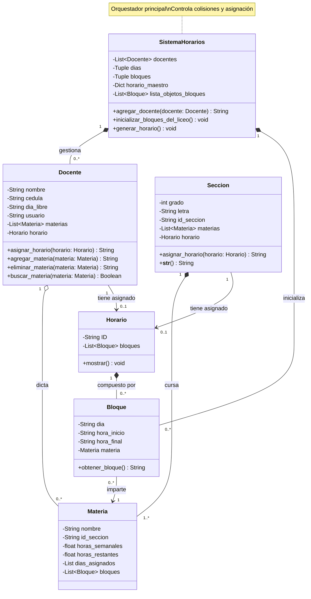

```mermaid
classDiagram
    direction TB
    
    %% Notas arquitectónicas opcionales para mayor claridad
    note for SistemaHorarios "Orquestador principal\nControla colisiones y asignación"

    class SistemaHorarios {
        -List~Docente~ docentes
        -Tuple dias
        -Tuple bloques
        -Dict horario_maestro
        -List~Bloque~ lista_objetos_bloques
        +agregar_docente(docente: Docente) String
        +inicializar_bloques_del_liceo() void
        +generar_horario() void
    }

    class Docente {
        -String nombre
        -String cedula
        -String dia_libre
        -String usuario
        -List~Materia~ materias
        -Horario horario
        +asignar_horario(horario: Horario) String
        +agregar_materia(materia: Materia) String
        +eliminar_materia(materia: Materia) String
        +buscar_materia(materia: Materia) Boolean
    }

    class Materia {
        -String nombre
        -String id_seccion
        -float horas_semanales
        -float horas_restantes
        -List dias_asignados
        -List~Bloque~ bloques
    }

    class Seccion {
        -int grado
        -String letra
        -String id_seccion
        -List~Materia~ materias
        -Horario horario
        +asignar_horario(horario: Horario) String
        +__str__() String
    }

    class Horario {
        -String ID
        -List~Bloque~ bloques
        +mostrar() void
    }

    class Bloque {
        -String dia
        -String hora_inicio
        -String hora_final
        -Materia materia
        +obtener_bloque() String
    }

    %% Relaciones con multiplicidad y semántica estricta (Composición vs Agregación)
    SistemaHorarios "1" *-- "0..*" Docente : gestiona
    SistemaHorarios "1" *-- "0..*" Bloque : inicializa
    
    %% Un docente puede no tener materias (0) o tener muchas (*)
    Docente "1" o-- "0..*" Materia : dicta
    
    %% Una sección debe tener al menos 1 materia
    Seccion "1" *-- "1..*" Materia : cursa
    
    %% Horarios asignados (0..1 significa que puede tenerlo o aún no)
    Docente "1" --> "0..1" Horario : tiene asignado
    Seccion "1" --> "0..1" Horario : tiene asignado
    
    Horario "1" *-- "0..*" Bloque : compuesto por
    Bloque "0..*" --> "1" Materia : imparte
```
